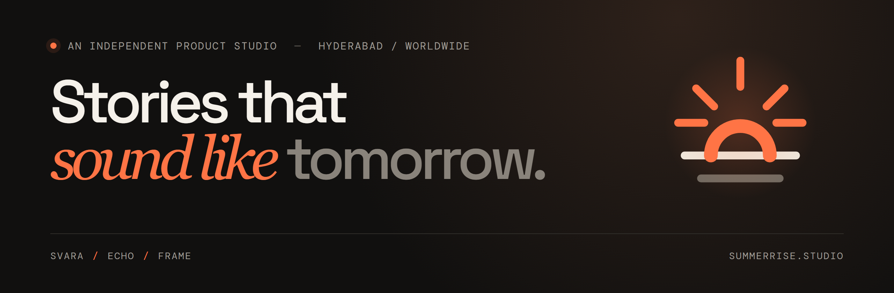

### Intelligent tools for the people who make culture — from the first frame to the final voice.

We're an early-stage, founder-led product studio from Hyderabad. We pair deep technology with a filmmaker's instinct for emotion, detail, and timing.

## Products

| | Product | What we're building | Stage |
|:--|:--|:--|:--|
| 01 | **[Svara](https://github.com/summerrise-studios/svara)** | Song translation that keeps a song's rhythm, rhyme, and emotion as it crosses languages — starting with Telugu to English. | Research / prototype |
| 02 | **[Echo](https://github.com/summerrise-studios/echo)** | Expressive AI voice dubbing that lets a character stay themselves as a story moves between languages. | Exploring |
| 03 | **[Frame](https://github.com/summerrise-studios/frame)** | AI pre-visualization that helps directors see a scene before the set is built. | Concept |

None of these is released yet. We'll build them in the open here, under the AGPL-3.0 license.

## Team

**Jampani Komal** · Founder · [@JampaniKomal](https://github.com/JampaniKomal)  
**Rohit Bhardwaj** · Co-founder · [@TheBhardwajRohit](https://github.com/TheBhardwajRohit)

## Get in touch

[Website](https://www.summerrise.studio) · [Email](mailto:jampanikomal@summerrise.studio) · [Get updates](https://www.summerrise.studio/#contact)
